# Devin Multi-Agent Architecture Diagram

```mermaid
graph TD
    %% Main Coordinator
    COORD[Coordinator<br/>glm-5-2-high<br/>Orchestrator]

    %% Code & Development Group
    subgraph CODE_DEVELOPMENT [Code & Development]
        PYTHON[python-reviewer<br/>glm-5-2-high<br/>Code Review]
        API[api-specialist<br/>glm-5-2-high<br/>API Design]
        TEST[testing-guardian<br/>kimi-k2-7<br/>Test Quality]
    end

    %% Infrastructure Group
    subgraph INFRASTRUCTURE [Infrastructure]
        STREAM[streamlit-expert<br/>kimi-k2-7<br/>UI Architecture]
        REDIS[redis-engineer<br/>kimi-k2-7<br/>Caching & Data]
        OLLAMA[ollama-specialist<br/>kimi-k2-7<br/>LLM Integration]
        DEVOPS[devops-docker<br/>kimi-k2-7<br/>Containers & Deployment]
    end

    %% Security & Quality Group
    subgraph SECURITY_QUALITY [Security & Quality]
        SECURITY[security-auditor<br/>glm-5-2-high<br/>Security Scan]
        VIDEO[video-pipeline-reviewer<br/>glm-5-2-high<br/>Video Pipeline]
    end

    %% Git Operations
    subgraph GIT_OPS [Git Operations]
        GIT[git-workflow<br/>kimi-k2-7<br/>Branch & Commits]
    end

    %% Coordinator Delegation
    COORD -->|delegates| PYTHON
    COORD -->|delegates| API
    COORD -->|delegates| TEST
    COORD -->|delegates| STREAM
    COORD -->|delegates| REDIS
    COORD -->|delegates| OLLAMA
    COORD -->|delegates| DEVOPS
    COORD -->|delegates| SECURITY
    COORD -->|delegates| VIDEO
    COORD -->|delegates| GIT

    %% Inter-agent relationships
    API -.->|reviewed by| PYTHON
    API -.->|tested by| TEST
    API -.->|audited by| SECURITY

    STREAM -.->|reviewed by| PYTHON
    STREAM -.->|tested by| TEST

    REDIS -.->|reviewed by| PYTHON
    REDIS -.->|audited by| SECURITY

    OLLAMA -.->|reviewed by| PYTHON
    OLLAMA -.->|tested by| TEST

    DEVOPS -.->|audited by| SECURITY

    GIT -.->|validates| PYTHON
    GIT -.->|validates| SECURITY

    %% Styling
    classDef coordinator fill:#ff6b6b,stroke:#c92a2a,stroke-width:3px,color:#fff
    classDef code fill:#4dabf7,stroke:#1864ab,stroke-width:2px,color:#fff
    classDef infra fill:#51cf66,stroke:#2b8a3e,stroke-width:2px,color:#fff
    classDef security fill:#fcc419,stroke:#e67700,stroke-width:2px,color:#000
    classDef git fill:#adb5bd,stroke:#495057,stroke-width:2px,color:#000

    class COORD coordinator
    class PYTHON,API,TEST code
    class STREAM,REDIS,OLLAMA,DEVOPS infra
    class SECURITY,VIDEO security
    class GIT git
```



## Workflow Patterns

### 1. API Development Flow
```
coordinator → api-specialist (design) → python-reviewer (review) → 
testing-guardian (validate) → security-auditor (scan) → coordinator (synthesize)
```

### 2. Streamlit App Development
```
coordinator → streamlit-expert (UI) → python-reviewer (review) → 
testing-guardian (validate) → security-auditor (scan) → coordinator (synthesize)
```

### 3. Infrastructure Setup
```
coordinator → devops-docker (containers) → security-auditor (scan) → 
coordinator (synthesize)
```

### 4. Git Workflow
```
coordinator → git-workflow (branch/commit) → python-reviewer (code review) → 
security-auditor (secrets check) → git-workflow (merge) → coordinator (synthesize)
```

### 5. Video Pipeline
```
coordinator → video-pipeline-reviewer (pipeline) → python-reviewer (review) → 
testing-guardian (validate) → coordinator (synthesize)
```

## Agent Capabilities Summary

| Agent | Model | Primary Focus | Tools |
|-------|-------|---------------|-------|
| **coordinator** | glm-5-2-high | Orchestration | read, grep, glob, exec, run_subagent |
| **python-reviewer** | glm-5-2-high | Code quality | ruff, black, isort |
| **api-specialist** | glm-5-2-high | API design | curl, docker logs |
| **security-auditor** | glm-5-2-high | Security | bandit, safety |
| **video-pipeline-reviewer** | glm-5-2-high | Video processing | ffmpeg, ffprobe |
| **streamlit-expert** | kimi-k2-7 | UI architecture | docker logs |
| **redis-engineer** | kimi-k2-7 | Caching | redis-cli, docker |
| **ollama-specialist** | kimi-k2-7 | LLM integration | curl, docker |
| **testing-guardian** | kimi-k2-7 | Test quality | pytest |
| **devops-docker** | kimi-k2-7 | Containers | docker, docker-compose |
| **git-workflow** | kimi-k2-7 | Git operations | git (limited) |

## Key Design Principles

1. **Single Responsibility**: Each agent has a clear, focused domain
2. **Hierarchical Delegation**: Coordinator breaks down tasks, specialists execute
3. **Parallel Execution**: Independent subtasks run concurrently when possible
4. **Cross-Validation**: Code reviewed by multiple specialists (security, testing, python)
5. **Safe Operations**: Git and destructive operations have limited permissions
6. **Model Selection**: High-capability models (glm-5-2-high) for complex tasks, efficient models (kimi-k2-7) for focused tasks
